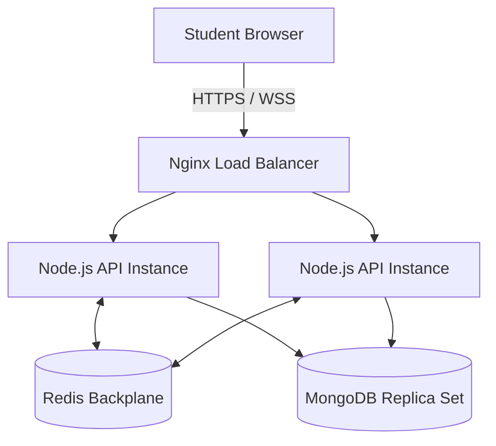
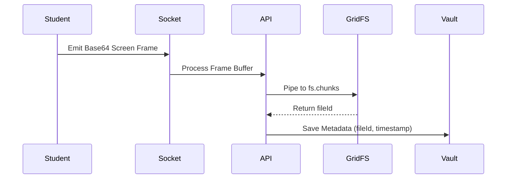

<div align="center">
  
  <h1>NEC EMS</h1>
  <p><b>Secure Enterprise Examination, Monitoring & Proctoring Platform</b></p>
  <p>
    
    
    
    
    
  </p>
</div>

---

## 📖 Executive Summary
NEC EMS is a hardened, enterprise-grade online examination and proctoring platform designed to eradicate academic dishonesty in remote and hybrid environments. Moving beyond traditional Learning Management Systems (LMS), NEC EMS focuses exclusively on high-stakes assessment delivery, real-time proctoring telemetry, immutable evidence collection, and automated Risk Analytics powered by a highly scalable Node.js/Redis architecture.

## 🎯 The Problem
Traditional examination platforms suffer from weak client-side security, severe scaling bottlenecks during concurrent load, and an inability to provide irrefutable evidence of malpractice. Furthermore, most systems lack granular Department/HOD scoping and comprehensive post-exam forensic analysis.

## 🚀 The Solution
NEC EMS solves these challenges by implementing a zero-trust architecture. Answers are server-side evaluated, all client telemetry (tab switching, dev-tools access) is streamed via WebSockets, and massive background screen-recording data is securely piped into a centralized **Evidence Vault** via MongoDB GridFS. A dynamic **Risk Engine** mathematically calculates student integrity, and a **Replay Center** allows faculty to playback an entire exam session timeline synchronously.

---

## 🏛 System Architecture

### 1. High-Level Architecture


### 2. Evidence Storage Architecture


---

## ✨ Unique Features
- **Live Replay Center:** DVR-style playback of a student's entire exam session, merging screenshots and violation events onto a unified timeline.
- **Risk Intelligence Engine:** Algorithms calculate a 0-100 Risk Score using weighted penalties for specific infractions (e.g., DevTools, Copy/Paste).
- **Zero Data-Loss Architecture:** Aggressive debounce-saving and state-hydration guarantees no answer loss even during complete internet or hardware failures.
- **Advanced Reporting Engine:** 19 dynamic reports exporting to PDF, CSV, Excel, and JSON, strictly RBAC-scoped for Admins, HODs, and Faculty.

---

## ⚙️ Installation & Deployment

### Bare-Metal (PM2)
```bash
git clone https://github.com/organization/NEC EMS.git
cd NEC EMS
pnpm install
pnpm run build

# Start the cluster
pm2 start ecosystem.config.cjs
```

### Docker Swarm / Compose
```bash
# Build and orchestrate the Nginx, API, and Redis cluster
docker-compose up -d --build
```

### Environment Configuration
```env
NODE_ENV=production
PORT=8080
MONGODB_URI=mongodb+srv://...
JWT_SECRET=your_secure_hash
REDIS_URL=redis://redis:6379
```

---

## 🛡 Security & Authorization (RBAC)
NEC EMS operates on a strict Role-Based Access Control matrix:
- **Admin:** Global system oversight, hardware device registration, raw audit logs.
- **HOD (Head of Department):** Departmental analytics, risk dashboarding, exam approval.
- **Faculty:** Exam creation, question banks, live grid monitoring, evidence review.
- **Student:** Secure locked-down examination delivery only.

---

## 📄 License
This project is licensed under the MIT License - see the LICENSE file for details.

