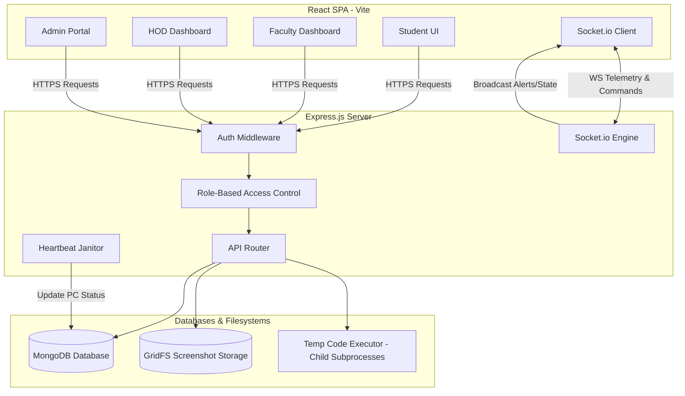
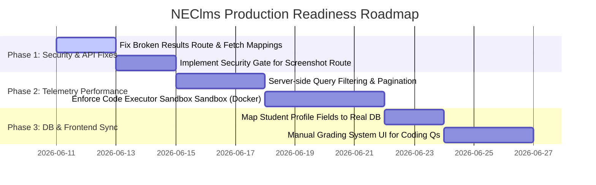

# NEClms Technical Audit & Discovery Report
**Author:** Principal Software Architect, Senior Full Stack Developer, Database Architect, QA Lead, Security Engineer, and DevOps Engineer
**Date:** June 2026
**Version:** 1.0.0

---

## 1. Executive Summary & Project Purpose

### 1.1 Project Purpose
The **NEClms** (National Engineering College Learning Management System) platform is a secure, full-stack examination and laboratory management portal designed to orchestrate academic courses, monitor real-time laboratory systems, and administer secure examinations. 

It provides customized control structures for four major operational roles:
*   **Admins:** Oversee system telemetry, manage physical computer laboratory setups, enforce system-wide controls (e.g., locking and unlocking labs), and manage core users.
*   **HODs (Heads of Department):** Monitor department-specific metrics, approve examinations scheduled by faculty, track real-time violations, and manage department staff.
*   **Faculty:** Author question banks, schedule examinations, monitor real-time exam telemetry, view evidence vaults containing security violation screenshots, and export student performance records.
*   **Students:** Participate in examinations, write code in the integrated offline compiler playground, review graded results, and manage academic profiles.

### 1.2 System Context
The application utilizes an **Express.js** API backend alongside a **React SPA** (Vite + TailwindCSS 3 + Radix UI) frontend. System telemetry (tab switches, screenshot capturing, window blurs) is captured on the student's browser and piped through Socket.io and GridFS to the HOD and Faculty dashboards, ensuring instant, real-time proctoring.

---

## 2. High-Level System Architecture Diagram

The system employs a layered architecture featuring state-driven real-time socket events for control and telemetry propagation. Below is the system architecture:



---

## 3. Database Schema & Relationships (Mongoose ERD)

The system relies on MongoDB to store transactional, logging, and structural documents. Here is the relational mapping of the schemas:

```mermaid
erDiagram
    DEPARTMENT {
        ObjectId _id PK
        String name
        String code
        ObjectId hod FK
        String description
        Boolean isActive
    }

    USER {
        ObjectId _id PK
        String name
        String email
        String password
        String role
        ObjectId department FK
        String phone
        String profilePic
        Boolean isActive
        Boolean isVerified
        Boolean mustChangePassword
        Date lastLogin
        String rollNumber
        String semester
        String academicYear
        Number cgpa
        String employeeId
        String designation
        String specialization
        String office
    }

    COURSE {
        ObjectId _id PK
        String title
        String code
        String description
        ObjectId department FK
        ObjectId faculty FK
        Number semester
        Number credits
        Number maxStudents
        ObjectIdArray enrolledStudents FK
        String syllabus
        Boolean isActive
        String academicYear
    }

    EXAM {
        ObjectId _id PK
        String title
        String description
        ObjectId course FK
        ObjectId faculty FK
        ObjectId department FK
        Array questions
        Number totalMarks
        Number duration
        Date scheduledAt
        Date endsAt
        ObjectIdArray allowedStudents FK
        ObjectIdArray assignedDevices FK
        String status
        Object security
        Number passingMarks
        Boolean isPublished
        Boolean approvedByHod
        ObjectId approvedBy FK
    }

    SUBMISSION {
        ObjectId _id PK
        ObjectId exam FK
        ObjectId student FK
        ObjectId device FK
        Mixed answers
        Number totalMarks
        Number marksObtained
        Number percentage
        String grade
        Boolean passed
        Date startedAt
        Date submittedAt
        Number timeTaken
        Array violations
        Number totalViolations
        Boolean isFlagged
        String flagReason
        String status
    }

    VIOLATION {
        ObjectId _id PK
        ObjectId student FK
        ObjectId exam FK
        ObjectId department FK
        String type
        String message
        Date timestamp
        String screenshot
        String severity
        Boolean isResolved
        ObjectId resolvedBy FK
    }

    DEVICE {
        ObjectId _id PK
        String hostname
        String ipAddress
        String macAddress
        ObjectId lab FK
        String location
        String os
        String deviceId
        ObjectId registeredBy FK
        ObjectId department FK
        String status
        Date lastSeen
        ObjectId currentStudent FK
        ObjectId currentExam FK
        String sessionToken
        Boolean isActive
    }

    LAB {
        ObjectId _id PK
        String name
        String code
        ObjectId department FK
        Number capacity
        String location
        String description
        Boolean isActive
        Object hardwareSpecs
        ObjectIdArray devices FK
    }

    DEPARTMENT ||--o{ USER : "has members"
    DEPARTMENT ||--o{ COURSE : "has"
    USER ||--o{ COURSE : "teaches"
    COURSE ||--o{ EXAM : "under"
    USER ||--o{ EXAM : "creates"
    EXAM ||--o{ SUBMISSION : "has"
    USER ||--o{ SUBMISSION : "submits"
    USER ||--o{ VIOLATION : "commits"
    EXAM ||--o{ VIOLATION : "occurs in"
    LAB ||--o{ DEVICE : "contains"
    DEPARTMENT ||--o{ LAB : "owns"
    DEVICE ||--o{ SUBMISSION : "used for"
```



---

## 4. Detailed Data Dictionary

### 4.1 `User` Schema
Represents all system actors (Admins, HODs, Faculty, Students, Lab Clients).

| Field Name | Data Type | Constraints | Description |
|---|---|---|---|
| `_id` | ObjectId | Primary Key | Unique internal identifier. |
| `name` | String | Required, Trim | Display name of the user. |
| `email` | String | Required, Unique, Lowercase | Primary contact / Login identifier. |
| `password` | String | Required, minlength 6 | Hashed password (Bcryptjs, 12 rounds). |
| `role` | String | Enum: `admin`, `hod`, `faculty`, `student`, `client` | System access role. |
| `department` | ObjectId | Ref: `Department` | Department allocation. |
| `phone` | String | Default: `""` | Phone number. |
| `profilePic` | String | Default: `""` | Profile picture URL. |
| `isActive` | Boolean | Default: `true` | Enables or disables login. |
| `isVerified` | Boolean | Default: `false` | Account email validation status. |
| `mustChangePassword`| Boolean | Default: `true` | Forces update on initial login. |
| `lastLogin` | Date | Optional | Last successful authentication timestamp. |
| `rollNumber` | String | Unique (Sparse Index) | Student unique roll number. |
| `semester` | String | Default: `""` | Student's current semester. |
| `academicYear` | String | Default: `""` | Student's cohort year. |
| `cgpa` | Number | Default: `0` | Cumulative GPA. |
| `employeeId` | String | Unique (Sparse Index) | Faculty/HOD staff identification. |
| `designation` | String | Default: `""` | Academic designation (e.g. Professor). |
| `specialization` | String | Default: `""` | Area of expertise. |
| `office` | String | Default: `""` | HOD office room/location. |

### 4.2 `Department` Schema
Represents the structural units of the institution.

| Field Name | Data Type | Constraints | Description |
|---|---|---|---|
| `_id` | ObjectId | Primary Key | Unique internal identifier. |
| `name` | String | Required, Unique, Trim | Full name (e.g. "Computer Science"). |
| `code` | String | Required, Unique, Uppercase | Short code (e.g. "CSE"). |
| `hod` | ObjectId | Ref: `User` | Head of Department identifier. |
| `description` | String | Default: `""` | Brief description. |
| `isActive` | Boolean | Default: `true` | Determines structural active status. |

### 4.3 `Course` Schema
Represents academic subjects taught by faculty members.

| Field Name | Data Type | Constraints | Description |
|---|---|---|---|
| `_id` | ObjectId | Primary Key | Unique internal identifier. |
| `title` | String | Required, Trim | Name of the course. |
| `code` | String | Required, Unique, Uppercase | Course catalog code (e.g., "CS301"). |
| `description` | String | Default: `""` | Syllabus overview. |
| `department` | ObjectId | Required, Ref: `Department` | Department context. |
| `faculty` | ObjectId | Required, Ref: `User` | Instructor identifier. |
| `semester` | Number | Required, Min: 1, Max: 8 | Target academic semester. |
| `credits` | Number | Default: `3` | Subject credits. |
| `maxStudents` | Number | Default: `60` | Student enrollment limit. |
| `enrolledStudents`| Array[ObjectId] | Ref: `User` | Array of student identifiers. |
| `syllabus` | String | Default: `""` | Detailed course structure. |
| `isActive` | Boolean | Default: `true` | Course status flag. |
| `academicYear` | String | Required | Target academic cycle. |

### 4.4 `Exam` Schema
Represents scheduled assessments that are secure and proctored.

| Field Name | Data Type | Constraints | Description |
|---|---|---|---|
| `_id` | ObjectId | Primary Key | Unique internal identifier. |
| `title` | String | Required, Trim | Title of the exam. |
| `description` | String | Default: `""` | Exam details. |
| `course` | ObjectId | Required, Ref: `Course` | Linked course code context. |
| `faculty` | ObjectId | Required, Ref: `User` | Creator / Procuring faculty. |
| `department` | ObjectId | Required, Ref: `Department` | Department allocation. |
| `questions` | Array[Object] | Sub-schema: `questionSchema` | List of questions inside this exam. |
| `totalMarks` | Number | Required | Exam maximum achievable score. |
| `duration` | Number | Required | Duration of exam in minutes. |
| `scheduledAt` | Date | Required | Scheduled exam start timestamp. |
| `endsAt` | Date | Optional | Scheduled exam conclusion. |
| `allowedStudents` | Array[ObjectId] | Ref: `User` | Whitelist of student IDs permitted. |
| `assignedDevices`  | Array[ObjectId] | Ref: `Device` | Whitelist of physical lab PCs allowed. |
| `status` | String | Enum: `draft`, `scheduled`, `active`, `completed`, `cancelled` | Live operational status. |
| `security` | Object | Default settings | Security configuration flags. |
| `passingMarks` | Number | Default: `0` | Minimum score to pass. |
| `isPublished` | Boolean | Default: `false` | Visibility toggle for student portal. |
| `approvedByHod` | Boolean | Default: `false` | Approval state for department. |
| `approvedBy` | ObjectId | Ref: `User` | Approver ID (HOD/Admin). |

**Nested `questionSchema` details:**
*   `type`: Enum (`mcq`, `text`, `coding`, `math`, `file`), default: `mcq`
*   `questionText`: String, Required
*   `options`: Object containing keys `A`, `B`, `C`, `D` (Casing critical)
*   `correctAnswer`: String (e.g. "A" for MCQs)
*   `language`: String (target programming language, e.g. "javascript")
*   `testCases`: Array of objects: `{ input: String, output: String }`
*   `answerType`: Enum (`short`, `long`), default: `short`
*   `allowedExtensions`: Array of strings
*   `marks`: Number, default: 1

### 4.5 `Submission` Schema
Represents an instance of an exam taken by a student, compiling answers and violations.

| Field Name | Data Type | Constraints | Description |
|---|---|---|---|
| `_id` | ObjectId | Primary Key | Unique internal identifier. |
| `exam` | ObjectId | Required, Ref: `Exam` | Link to the exam. |
| `student` | ObjectId | Required, Ref: `User` | Link to the candidate student. |
| `device` | ObjectId | Ref: `Device` | Physical computer used during the test. |
| `answers` | Mixed | Default: `{}` | Index-value map storing answers. |
| `totalMarks` | Number | Default: `0` | Exam maximum marks. |
| `marksObtained` | Number | Default: `0` | Total graded marks. |
| `percentage` | Number | Default: `0` | Computed percentage score. |
| `grade` | String | Default: `""` | Calculated grade letter. |
| `passed` | Boolean | Default: `false` | Pass status indicator. |
| `startedAt` | Date | Optional | Exam commencement timestamp. |
| `submittedAt` | Date | Optional | Exam submission timestamp. |
| `timeTaken` | Number | Optional | Total duration spent in seconds. |
| `violations` | Array[Object] | Sub-schema: `violationEventSchema` | Array of violations logged in this session. |
| `totalViolations` | Number | Default: `0` | Total count of violations. |
| `isFlagged` | Boolean | Default: `false` | Proctor flag status. |
| `flagReason` | String | Default: `""` | Proctor note explaining manual flags. |
| `status` | String | Enum: `in_progress`, `submitted`, `auto_submitted`, `terminated` | Current status of the exam session. |

### 4.6 `Violation` Schema
Represents real-time telemetry events logged during exams.

| Field Name | Data Type | Constraints | Description |
|---|---|---|---|
| `_id` | ObjectId | Primary Key | Unique internal identifier. |
| `student` | ObjectId | Required, Ref: `User` | Transgressing student ID. |
| `exam` | ObjectId | Required, Ref: `Exam` | Associated exam ID. |
| `department` | ObjectId | Ref: `Department` | Department context. |
| `type` | String | Enum: `tab_switch`, `copy_paste`, `fullscreen_exit`, `devtools_open`, `right_click`, `window_blur`, `keyboard_shortcut`, `inactivity`, `unauthorized_face`, `multiple_faces`, `phone_detected`, `periodic_snapshot`, `switched_tab`, `tools_open` | The nature of the proctoring alert. |
| `message` | String | Default: `""` | Contextual alert info. |
| `timestamp` | Date | Default: `Date.now` | Event timestamp. |
| `screenshot` | String | Default: `""` | GridFS file URL storing image binaries. |
| `severity` | String | Enum: `low`, `medium`, `high` | Level of violation severity. |
| `isResolved` | Boolean | Default: `false` | Flag to close the alert. |
| `resolvedBy` | ObjectId | Ref: `User` | Instructor resolving the alert. |

### 4.7 `Device` Schema
Represents physical computing nodes installed in the laboratory classes.

| Field Name | Data Type | Constraints | Description |
|---|---|---|---|
| `_id` | ObjectId | Primary Key | Unique internal identifier. |
| `hostname` | String | Required, Trim | Name of the host computer. |
| `ipAddress` | String | Required | IPv4/IPv6 Address. |
| `macAddress` | String | Default: `""` | MAC address. |
| `lab` | ObjectId | Ref: `Lab` | Containing laboratory ID. |
| `location` | String | Default: `""` | Floor/Block description. |
| `os` | String | Default: `"Windows 11"` | Operating System specification. |
| `deviceId` | String | Unique | HWID fingerprint. |
| `registeredBy` | ObjectId | Ref: `User` | Admin user who registered the computer. |
| `department` | ObjectId | Ref: `Department` | Owner department context. |
| `status` | String | Enum: `online`, `offline`, `exam`, `locked`, `maintenance` | Current operational state. |
| `lastSeen` | Date | Optional | Last received heartbeat signal. |
| `currentStudent` | ObjectId | Ref: `User` | User actively logged into the station. |
| `currentExam` | ObjectId | Ref: `Exam` | Running exam on this terminal. |
| `sessionToken` | String | Default: `""` | Secure authentication token. |
| `isActive` | Boolean | Default: `true` | Administrative toggle for availability. |

---

## 5. Complete API Endpoint Specification

All endpoints are prefixed with `/api`. Security layers are implemented using `authMiddleware` (attaches `req.user` decoded from JWT) and `roleMiddleware` (enforces RBAC).

### 5.1 Authentication API

#### `POST /api/auth/login`
*   **Description:** Authenticates username/password, updates `lastLogin`, generates JWT.
*   **Authentication:** None.
*   **Request Body:**
    ```json
    {
      "email": "student@example.com",
      "password": "password"
    }
    ```
*   **Response Format (200 OK):**
    ```json
    {
      "token": "eyJhbGciOi...",
      "user": {
        "_id": "603d...",
        "name": "Jane Doe",
        "email": "student@example.com",
        "role": "student",
        "department": "603c..."
      }
    }
    ```
*   **Errors:** `400 Bad Request` (Invalid credentials), `404 Not Found` (User missing).

#### `POST /api/auth/logout`
*   **Description:** Logs out current session.
*   **Authentication:** Required.
*   **Response Format (200 OK):** `{ "success": true }`

#### `GET /api/auth/me`
*   **Description:** Gets logged-in user profile payload from current token.
*   **Authentication:** Required.
*   **Response Format (200 OK):** User Object (excluding sensitive keys).

---

### 5.2 Users API

#### `GET /api/users`
*   **Description:** Get list of all users, filterable by query parameters.
*   **Authentication:** Admin, HOD.
*   **Query Params:** `role` (student/faculty), `department` (ObjectId), `limit` (Number).
*   **Response Format (200 OK):** `Array[User]`

#### `POST /api/users`
*   **Description:** Add a single user.
*   **Authentication:** Admin.
*   **Request Body:** User schema structure.
*   **Response Format (201 Created):** Created User Object.

#### `POST /api/users/bulk`
*   **Description:** Bulk add users (typically via CSV upload parsing).
*   **Authentication:** Admin, HOD.
*   **Request Body:**
    ```json
    {
      "users": [
        { "name": "Prof A", "email": "profa@example.com", "employeeId": "F001", "password": "tempPassword" }
      ],
      "role": "faculty"
    }
    ```
*   **Response Format (200 OK):**
    ```json
    {
      "success": 1,
      "errors": 0,
      "skipped": 0
    }
    ```

---

### 5.3 Laboratory & Device Management API

#### `GET /api/devices`
*   **Description:** Get all registered laboratory computers.
*   **Authentication:** Admin, HOD, Faculty.
*   **Response Format (200 OK):** `Array[Device]`

#### `POST /api/devices/register`
*   **Description:** Setup and register a client terminal node.
*   **Authentication:** Admin.
*   **Request Body:**
    ```json
    {
      "hostname": "LAB-01-PC05",
      "ipAddress": "192.168.1.5",
      "macAddress": "00:0a:95:9d:68:16",
      "deviceId": "hwid_hash_fingerprint_01"
    }
    ```
*   **Response Format (201 Created):** Registered Device Object.

#### `POST /api/lab/control`
*   **Description:** Broadcast lock, unlock, shutdown commands to lab terminals.
*   **Authentication:** Admin, HOD.
*   **Request Body:**
    ```json
    {
      "command": "lock_all",
      "target": "all" // or specific lab ID
    }
    ```
*   **Response Format (200 OK):** `{ "success": true, "message": "Command broadcasted" }`

---

### 5.4 Exam & Telemetry API

#### `POST /api/exams`
*   **Description:** Create a new assessment schedules.
*   **Authentication:** Faculty, HOD, Admin.
*   **Response Format (201 Created):** Created Exam Object.

#### `GET /api/exams/:id`
*   **Description:** Fetch single exam configuration.
*   **Authentication:** Required (Any role).
*   **Response Format (200 OK):** Exam Object.

#### `POST /api/submissions/start`
*   **Description:** Initialize or resume a live exam session.
*   **Authentication:** Student.
*   **Request Body:** `{ "examId": "603d..." }`
*   **Response Format (200 OK):** Active Submission Object.

#### `PUT /api/submissions/:id/answers`
*   **Description:** Synchronize answers and log violations during an active exam.
*   **Authentication:** Student.
*   **Request Body:**
    ```json
    {
      "answers": { "0": "A", "1": "Code text here" },
      "violations": [ { "type": "tab_switch", "timestamp": "2026-06-11T12:00:00Z" } ]
    }
    ```
*   **Response Format (200 OK):** `{ "success": true }`

#### `POST /api/submissions/:id/submit`
*   **Description:** Concludes, locks and auto-grades MCQ questions.
*   **Authentication:** Student.
*   **Request Body:** `{ "answers": { ... }, "terminationReason": "user_submit" }`
*   **Response Format (200 OK):**
    ```json
    {
      "success": true,
      "score": 14,
      "percentage": 70,
      "grade": "B"
    }
    ```

#### `GET /api/exams-telemetry` (Mapped to service `getSubmissions`)
*   **Description:** Retrieve active exam sessions and telemetry status.
*   **Authentication:** Admin, HOD, Faculty.
*   **Response Format (200 OK):** `Array[Submission]`

#### `POST /api/violations`
*   **Description:** Logs an active violation alert and stores its screenshot.
*   **Authentication:** Student.
*   **Request Body:**
    ```json
    {
      "examId": "603d...",
      "type": "tab_switch",
      "screenshot": "data:image/jpeg;base64,...",
      "message": "Switched tab to browser",
      "severity": "medium"
    }
    ```
*   **Response Format (201 Created):** `{ "success": true, "violation": { ... } }`

#### `GET /api/screenshots/:fileId`
*   **Description:** Stream screenshot image binary directly from GridFS.
*   **Authentication:** **None (Security Vulnerability)**
*   **Response Format (200 OK):** Image Binary (`image/jpeg`)

---

## 6. High-Level Telemetry & System Control Data Flows

### 6.1 Real-Time Telemetry & Evidence Flow
```
[Student Exam UI]
       │
       ├─► (Every 10s or on violation)
       │   POST /api/violations { Base64 Screenshot, type }
       │   │
       │   ▼
       │ [Express Router]
       │   │
       │   ▼
       │ [GridFS Storage] ──► (Stores binary file, returns fileId)
       │   │
       │   ▼
       │ [Mongoose Model] ──► (Saves Violation doc with URL: /api/screenshots/fileId)
       │   │
       │   ▼
       │ [Socket.io Server] 
       │   │
       │   ▼ (Emits "new-violation")
       │ [Faculty/HOD Dashboards]
       │
       └─► (Every 3s)
           Socket.emit("screen-data") ──► [Socket.io Server] ──► [Faculty Dashboard Live Feed]
```

### 6.2 Lab Lock/Unlock Control Flow
```
[Admin/HOD Control Page]
       │
       ▼ (Clicks LOCK LABS)
   POST /api/lab/control { command: "lock_all" }
       │
       ▼
   [Express Route Handler]
       │
       ├─► Update status of all active Devices in MongoDB to "locked"
       │
       ▼
   [Socket.io Server] ──► (Emits "lock-lab" command to room)
       │
       ▼
   [Lab Client Terminals / Simulator]
       │
       ▼
   Enforce System Shell Lock GUI Screen
```

---

## 7. Security Audit Findings

> [!WARNING]
> ### Finding 1: Unauthenticated Screenshot Stream Endpoint
> *   **Location:** `server/routes/screenshots.js` -> `handleGetScreenshot`
> *   **Description:** The route `/api/screenshots/:fileId` handles direct requests for image streaming. It specifies a static HTTP header to cache content and immediately streams GridFS bytes without verifying the authentication status or the role permissions of the sender.
> *   **Risk:** High. Anyone with the URL of a screenshot can read the candidate's monitor logs, potentially leaking exam contents or personal information.

> [!IMPORTANT]
> ### Finding 2: Base64 GridFS Storage Bypass
> *   **Location:** `server/routes/violations.js` -> `handleCreateViolation`
> *   **Description:** The verification condition check `if (screenshot && (screenshot.startsWith("data:image") || screenshot.length > 1000))` falls back to directly setting the field to the raw string if the check fails.
> *   **Risk:** Medium. If an attacker passes a small Base64 payload or a custom script, it gets directly written to the MongoDB text field, bypassing GridFS and increasing the likelihood of database bloat and storage failures.

> [!NOTE]
> ### Finding 3: Lack of Input Sanitization on Question Editor
> *   **Location:** `server/routes/hod.js` & `server/routes/exams.js` -> `handleCreateHODExam` / `handleCreateExam`
> *   **Description:** Questions are saved as a sub-document array without any string sanitization or sanitizing input fields (e.g. `questionText` or code snippets).
> *   **Risk:** Medium. If a malicious teacher creates an exam with questions containing `<script>` tags, this could lead to Stored Cross-Site Scripting (XSS) when a student loads the Exam Interface, letting them run background actions on behalf of the student.

> [!CAUTION]
> ### Finding 4: Insecure Local Code Execution Environment
> *   **Location:** `server/utils/codeExecutor.js` -> `executeCode`
> *   **Description:** Coding exams execute candidate submissions by creating temporary files (`sessionId.py`, `sessionId.cpp`) and launching shell processes via `child_process.exec()` inside the server. While there is a basic regex block for simple terms (`child_process`, `os.system`), there are many ways to bypass it (e.g., string concatenation, imports, base64 decoding).
> *   **Risk:** High. An attacker could bypass the keyword filters and run arbitrary commands on the server host machine, potentially leading to remote code execution (RCE).

---

## 8. Performance Bottlenecks

> [!IMPORTANT]
> ### Bottleneck 1: Client-Side Telemetry Filtering
> *   **Location:** `client/modules/faculty/pages/Evidence.jsx` -> Line 28
> *   **Description:** The component downloads the entire history of violations using `/api/violations` and performs client-side filtering via `res.filter(...)` to isolate details for a specific student and exam.
> *   **Impact:** Severe. When the database size grows over time, the client will experience lag when loading the evidence dashboard. The server will also experience memory and CPU issues as it reads the entire collection from MongoDB for every gallery view request.

> [!TIP]
> ### Bottleneck 2: Lack of Query Pagination
> *   **Location:** `/api/violations`, `/api/exams-telemetry` (handleGetSubmissions)
> *   **Description:** There are no limits or cursors enforced in standard fetch handlers.
> *   **Impact:** Performance degrades over time as the database grows, increasing response payloads.

---

## 9. Non-Conforming & Incomplete Features

### 9.1 Broken Navigation Endpoint (Faculty Results)
The `FacultyResults` component (`client/modules/faculty/pages/Results.jsx`) attempts to fetch database states with:
```javascript
queryFn: () => apiClient.get("/api/submissions")
```
However, the Express server router (`server/index.js`) does not expose `/api/submissions`. It maps `handleGetSubmissions` to `/api/exams-telemetry`. This mismatch causes a 404 error, breaking the results list page on the Faculty dashboard.

### 9.2 Fallback/Mock Student profile Fields
In the student profile dashboard (`client/modules/student/pages/MyExams.jsx`), fields such as `cgpa`, `semester`, `academicYear`, and `rollNumber` are coded to fall back to mock placeholder strings (e.g., `"CS21001"`, `"7.8 / 10"`). These fields should be queried directly from the `StudentProfile` model or the student's User document.

---

## 10. Production-Ready Transition Roadmap



### 10.1 Key Tasks for Transition
1.  **Resolve Mappings:** Point `/api/submissions` to `/api/exams-telemetry` or update the frontend client requests to prevent API failures on the results pages.
2.  **Add Authentication to Screen Streaming:** Update `/api/screenshots/:fileId` to use the authorization middleware to restrict access to authenticated teachers, HODs, or admins.
3.  **Implement Server-Side Query Filters:** Refactor `handleGetViolations` to support `examId` and `studentId` query parameters, ensuring only the necessary telemetry data is sent over the network.
4.  **Sandbox the Code Execution:** Replace the local subshell execution strategy with a containerized environment (e.g., Docker or a secure sandbox service like Judge0) to prevent remote code execution.
5.  **Clean up Mock Data:** Update student profile views to query the database, ensuring all metrics are pulled from actual database records.
